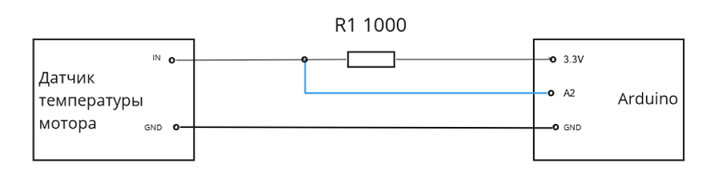

# boat-controller
Модулем boat-controller является код, написанный на С++, под Arduino MEGA 2560. 
Код хранится на гитхабе [mospolytech-solar-regatta/boat-contoller](https://github.com/mospolytech-solar-regatta/boat-controller).

Назначение этого модуля - это взаимодействие с датчиками на лодке, первичная обработка данных с этих датчиков и передача информации на Raspberry Pi. Также этот модуль осуществляет передачу данных на берег.
Во всех модулях присутсвует 2 файла .h и .cpp. В .h описывается какие библиотеки, поля и функции использует данный модуль. В .cpp находится сам исполняемый код.
## Окружение
Что-то про platformio
## Мотор
motor.h | motor.cpp

Модуль работает с двумя параметрами (температурой и количеством оборотов мотора). 
### температура
Мы используем мотор RV-120Es с встроенным датчиком температуры [KTY84](datasheets/KTY84_SER.pdf). Он представляет собой резистор, сопротивление которого меняется в зависимости от его температуры.

Получение данных о температуре совершается в 2 шага: получение сопротивления датчика в данный момент и перевод этого значения в температуру.
* получение сопротивления происходит благодаря схеме [делителя напряжения](https://ru.wikipedia.org/wiki/Делитель_напряжения), представленной на рисунке. Из полученного на А2 напряжения 

2. 

### обороты
## Контроллер
## BMV
## MPPT
## GPS
## Телеметрия
 